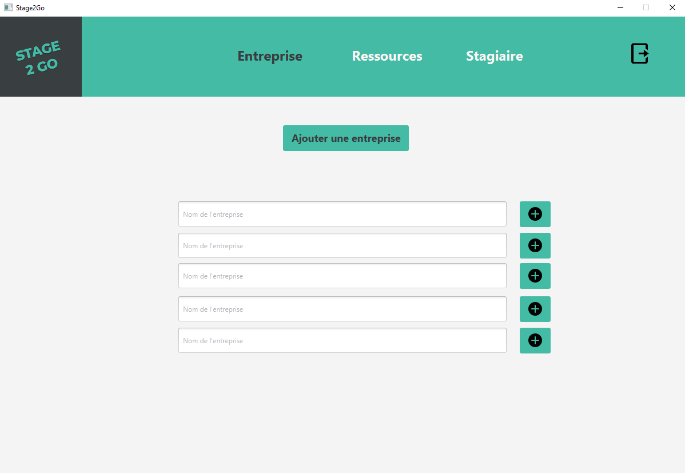

#  :rocket: STAGE2GO

# Table des matières
1. [Illustration](#Illustration)
2. [Description](#Description)
3. [Objectif](#Objectif)
4. [Langages](#Langages)
5. [Statut](#Statut)
6. [Contexte](#Contexte)
7. [Developpeurs](#Developpeurs)

## 1. Illustration 

##  2. Description 
Nous cherchons à développer une application permettant de recenser les différentes entreprises ayant déjà accepté d’anciens stagiaires du GRETA afin de faciliter les recherches des stagiaires de l’année en cours.
Cet outil est interne au GRETA de Vannes et n'a pas vocation à servir de plateforme d'échange direct entre les entreprises et les stagiaires. Il permet uniquement d’accéder à des ressources informatives.

### Les besoins
- pouvoir accéder à une base de données renfermant les informations nécessaires à la recherche d’un stage en entreprise.
- l’accès se fait via une application de bureau Java

### La cible
l’application sera utilisée essentiellement par les stagiaires du Greta
elle pourra être également utilisée par l’ensemble du personnel administratif du Greta

### MVP
#### En tant que stagiaire :
- Pouvoir se connecter sur l'application
- Pouvoir consulter la liste des entreprises
- Pouvoir consulter la fiche d'une entreprise
- Pouvoir mettre en favoris une entreprise
- Pouvoir accéder à son profil utilisateur
- Pouvoir accéder à la liste des ressources
- Pouvoir se déconnecter

#### En tant qu'admin :
- Pouvoir se connecter à l'application
- Pouvoir consulter la liste des entreprises
- Pouvoir consulter la fiche d'une entreprise
- Pouvoir ajouter une nouvelle fiche entreprise
- Pouvoir inscrire un stagiaire
- Pouvoir consulter la liste des ressources
- Pouvoir se déconnecter

## 3. Objectif 
- Découvrir le langage Java
- Mettre en place un projet Maven
- Découvrir la programmation orientée objet
- Utiliser le patron de conception MVC
- Utiliser le design pattern Singleton
- Gérer la connection avec la base de données
- Créer une application web sécurisée

## 4. Langages/Outils 
### Back
- Java
- Microsoft SQL Server Management

### Front
- JavaFX
- Scene Builder

### IDE
- Intellij

### Outils
- Figma (Wireframing)
- Icons8 (https://icons8.com/)
- Google Drive (Rédaction des documents)
- Discord (Chat/Visio)
- Jitsi meet (Visio)

## 5. Statut 

L'application est en cours de développement.

## 6. Contexte 

C’est un projet qui s’inscrit dans le parcours de formation de notre BTS SIO option SLAM, promotion 2021-2022.
Chaque année un certain nombre de stagiaires ont des difficultés à trouver des entreprises pouvant les accueillir afin d'effectuer leur période de stage.

## 7. Développeurs 

Ce projet a été conçu par :
- Maxime - maximearchenoul@gmail.com
- Leo - leo.agrinier6@gmail.com
- Bastien - bastien.lesueur56@gmail.com
- Aurelia - av.segarra@gmail.com